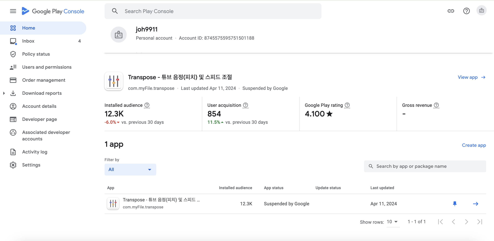

# Transpose

### 프로젝트 소개
피치 및 템포 조절, 베이스부스터, 이퀼라이저, 리버브, 3D 오디오 효과를 실시간으로 적용하며 유튜브 컨텐츠를 감상할 수 있습니다.

 

### 음원 다운로드 불필요
음원을 다운받아 특정 오디오 효과 앱에서 재생할 필요 없이, 실시간으로 적용이 가능합니다.

 

### 기존 유튜브의 주요 기능 탑재
* 비디오 검색 기능
  * 유튜브 내의 모든 비디오 검색이 가능합니다.
* 백그라운드 재생 기능
  * 화면을 끄거나, 홈 버튼을 눌러도 감상이 가능합니다.
  * 알림바를 통해, 백그라운드 상태에서도 음정 조절이 가능합니다.
* 재생목록 추가 기능
  * 자주 듣고 싶은 영상을 재생목록에 추가할 수 있습니다.
* 주요 국가의 음원 순위 조회가 가능합니다.

 

### 기술 스택
ViewModel, Navigation, Room, LiveData, RXJava, Retrofit2, MVVM + Repository pattern, Media3

 

## Launch Screen

<table>
    <tr>
        <th>홈 탭</th>
        <th>변환 탭</th>
        <th>비디오 플레이어</th>
    </tr>
    <tr>
        <td valign="top">
            
        </td>
        <td valign="top">
            
        </td>
        <td valign="top">
            
        </td>
    </tr>
</table>

<table>
    <tr>
        <th>검색 화면</th>
        <th>플레이리스트 생성</th>
        <th>플레이리스트 비디오 추가</th>
    </tr>
    <tr>
        <td valign="top">
            
        </td>
        <td valign="top">
            
        </td>
        <td valign="top">
            
        </td>
    </tr>
</table>

<table>
    <tr>
        <th>알람 컨트롤</th>
        <th>공유 링크 기능</th>
        <th>로컬 파일 조회</th>
    </tr>
    <tr>
        <td valign="top">
            
        </td>
        <td valign="top">
            
        </td>
        <td valign="top">
            
        </td>
    </tr>
</table>

 

### 블로그 정리

구현 과정에서 많은 시간과 노력이 필요했던 부분들을 블로그에 상세히 정리하였습니다. 주요 기술적 도전 과제와 해결 방법, 그리고 학습한 내용을 공유하고 있으니, 관심 있으신 분들은 참고해 주시기 바랍니다.

[개발 과정 블로그 포스팅 보러가기](https://joh9911-programming-note.tistory.com/category/%EC%95%88%EB%93%9C%EB%A1%9C%EC%9D%B4%EB%93%9C%20%ED%94%84%EB%A1%9C%EC%A0%9D%ED%8A%B8/%EC%9C%A0%ED%8A%9C%EB%B8%8C%20%EC%9D%8C%EC%A0%95%20%EC%A1%B0%EC%A0%88%20%EC%96%B4%ED%94%8C%EB%A6%AC%EC%BC%80%EC%9D%B4%EC%85%98)

 

## 플레이스토어

- **📈 사용자 수**: 약 15,000명의 사용자 유치
- **⭐ 평균 평점**: [4.1] (리뷰 [235] 건 기준)
- **🌍 서비스 국가**: 전세계 타겟

이러한 성과는 사용자들의 니즈를 정확히 파악하고, 지속적인 개선과 업데이트를 통해 이루어낸 결과입니다. 사용자 여러분의 소중한 피드백이 앱의 발전에 큰 도움이 되었습니다.

[플레이스토어에서 앱 확인하기](https://play.google.com/store/apps/details?id=com.myFile.transpose&hl=En)

> 📢 **현재 공지**: 저작권 문제로 인해 앱 서비스가 일시 중단되었습니다.

>프로젝트의 경험과 코드를 공유하고자 오픈소스로 공개하였습니다. 프로젝트에 대한 자세한 내용과 소스 코드는 아래 링크에서 확인하실 수 있습니다:
> 
> [Transpose - 유튜브 음정 조절 앱 (GitHub)](https://github.com/joh9911/Transpose_Compose)

  

### 사용자 유치 기록

#### 파이어베이스 분석 화면

#### 플레이스토어 화면

