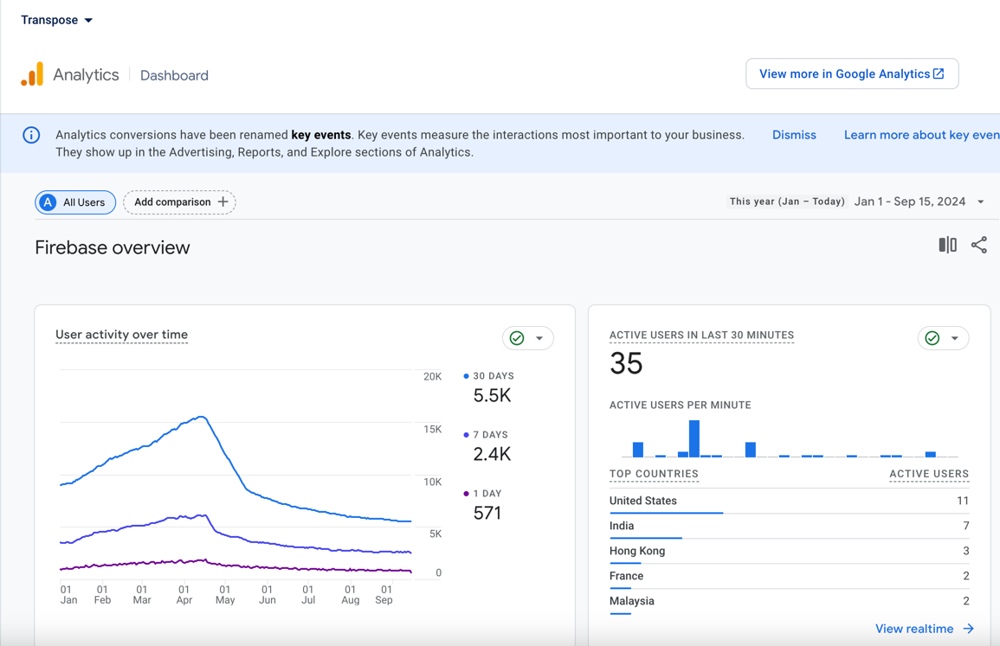

# 🎵 Transpose

## 📱 프로젝트 소개

Transpose는 유튜브 컨텐츠를 실시간으로 다양한 오디오 효과와 함께 감상할 수 있는 안드로이드 앱입니다.

### 🚀 주요 기능

- 실시간 피치 및 템포 조절
- 베이스부스터
- 이퀼라이저
- 리버브
- 3D 오디오 효과

### 💡 특징

- **음원 다운로드 불필요**: 실시간으로 유튜브 컨텐츠에 오디오 효과 적용
- **유튜브의 주요 기능 통합**:
    - 🔍 비디오 검색
    - 🎧 백그라운드 재생
    - 📋 재생목록 관리
    - 🌍 주요 국가 음원 순위 조회

## 🛠 기술 스택

- ViewModel
- Navigation
- Room
- LiveData
- RXJava
- Retrofit2
- MVVM + Repository pattern
- Media3

## 🖼 스크린샷

### 메인 기능
<table>
    <tr>
        <th>홈 탭</th>
        <th>변환 탭</th>
        <th>비디오 플레이어</th>
    </tr>
    <tr>
        <td></td>
        <td></td>
        <td></td>
    </tr>
</table>

### 부가 기능
<table>
    <tr>
        <th>검색 화면</th>
        <th>플레이리스트 생성</th>
        <th>플레이리스트 비디오 추가</th>
    </tr>
    <tr>
        <td></td>
        <td></td>
        <td></td>
    </tr>
</table>

### 추가 기능
<table>
    <tr>
        <th>백그라운드 음정 조절</th>
        <th>공유 링크 기능</th>
        <th>로컬 파일 조회</th>
    </tr>
    <tr>
        <td></td>
        <td></td>
        <td></td>
    </tr>
</table>

<table>
    <tr>
        <th>전체화면 모드</th>
        <th>페이지에 따른 검색 모드 변경</th>
    </tr>
    <tr>
        <td></td>
        <td></td>
    </tr>
</table>

## 📝 개발 과정 및 도전 과제

구현 과정에서 많은 시간과 노력이 필요했던 부분들을 블로그에 상세히 정리하였습니다. 주요 기술적 도전 과제와 해결 방법, 그리고 학습한 내용을 공유하고 있으니, 관심 있으신 분들은 참고해 주시기 바랍니다.

[🔗 개발 과정 블로그 포스팅 보러가기](https://joh9911-programming-note.tistory.com/category/%EC%95%88%EB%93%9C%EB%A1%9C%EC%9D%B4%EB%93%9C%20%ED%94%84%EB%A1%9C%EC%A0%9D%ED%8A%B8/%EC%9C%A0%ED%8A%9C%EB%B8%8C%20%EC%9D%8C%EC%A0%95%20%EC%A1%B0%EC%A0%88%20%EC%96%B4%ED%94%8C%EB%A6%AC%EC%BC%80%EC%9D%B4%EC%85%98)

## 🏆 플레이스토어 성과

- **📈 사용자 수**: 약 15,000명의 사용자 유치
- **⭐ 평균 평점**: 4.1 (리뷰 235건 기준)
- **🌍 서비스 국가**: 전세계 타겟

이러한 성과는 사용자들의 니즈를 정확히 파악하고, 지속적인 개선과 업데이트를 통해 이루어낸 결과입니다. 사용자 여러분의 소중한 피드백이 앱의 발전에 큰 도움이 되었습니다.

[🔗 플레이스토어에서 앱 확인하기](https://play.google.com/store/apps/details?id=com.myFile.transpose&hl=En)

> 📢 **현재 공지**: 저작권 문제로 인해 앱 서비스가 일시 중단되었습니다.
>
> 프로젝트의 경험과 코드를 공유하고자 오픈소스로 공개하였습니다. 프로젝트에 대한 자세한 내용과 소스 코드는 아래 링크에서 확인하실 수 있습니다:
>
> [🔗 Transpose - 유튜브 음정 조절 앱 (GitHub)](https://github.com/joh9911/Transpose_Compose)

📊 사용자 유치 및 피드백
📈 성장 지표
<table>
  <tr>
    <td width="50%" align="center">
      <strong>파이어베이스 분석</strong> 
      
    </td>
    <td width="50%" align="center">
      <strong>플레이스토어 통계</strong> 
      
    </td>
  </tr>
</table>

<h3>💌 주요 사용자 피드백</h3>

사용자들의 소중한 의견은 앱 개선의 핵심 동력이 되었습니다. 메일과 플레이스토어 리뷰를 통해 다양한 피드백을 받았습니다.

<table>
  <tr>
    <td width="50%" align="center">
      <strong>이메일 피드백 1</strong> 
      
    </td>
    <td width="50%" align="center">
      <strong>플레이스토어 리뷰 1</strong> 
      
    </td>
  </tr>
  <tr>
    <td width="50%" align="center">
      <strong>이메일 피드백 2</strong> 
      
    </td>
    <td width="50%" align="center">
      <strong>플레이스토어 리뷰 2</strong> 
      
    </td>
  </tr>
</table>
